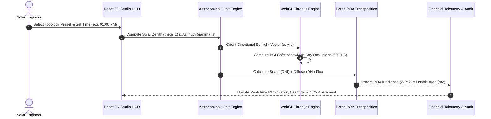

# SunMap — 3D Spatial Solar Energy & Rooftop Intelligence Engine

[](https://threejs.org/)
[](https://react.dev)
[](https://www.python.org/)
[](https://www.docker.com/)
[](LICENSE)

**SunMap** is an enterprise-grade spatial intelligence and 3D simulation platform engineered for urban photovoltaic (PV) yield prediction, CityGML LOD2 rooftop normal extraction, real-time WebGL shadow raycasting, and 25-year bankable financial forecasting.

* **Repository:** [https://github.com/GuruMachanica/SunMap](https://github.com/GuruMachanica/SunMap)
* **Live Studio Port:** `http://localhost:5175/`
* **Hackathon Recognition:** CodeStorm’25 Project

---

## Key Capabilities

* **Hardware-Accelerated 3D Ray-Tracing**: Real-time WebGL directional shadow raycasting (`PCFSoftShadowMap`, 4096x4096 resolution) modeling building setbacks, rooftop HVAC obstacles, trees, and adjacent high-rises.
* **Sub-Degree CityGML LOD2 Normal Extractor**: Parses OGC CityGML vector polygon facets, surface normal vectors `[nx, ny, nz]`, rooftop surface area (`m²`), tilt pitch, and azimuth orientations.
* **Perez Clear-Sky Transposition Physics**: Transposes Global Horizontal (GHI), Direct Normal (DNI), and Diffuse Horizontal (DHI) irradiance into accurate Plane-of-Array (POA) fluxes benchmarked against NREL PVLib.
* **Astronomical Solar Arc Tracking**: Diurnal celestial calculations computing solar zenith angle (\(\theta_z\)), azimuth (\(\gamma_s\)), and airmass attenuation across all 8,760 hourly annual vectors.
* **Dynamic Single-Axis Tracker Modeler**: Simulates 0° to 45° single-axis horizontal and tilted PV tracker matrices with active backtracking.
* **Multi-Topology Architectural Environments**:
  * **Commercial Logistics Campus**: Multi-wing corporate HQ with 6 PV carports, data center, and chiller plants (Frankfurt, Germany).
  * **High-Rise Metropolitan District**: 16 dense skyscrapers with glass curtain facades, rooftop helipads, skybridges, and communications spires (Chicago Loop, USA).
  * **Suburban Residential Village**: 16 eco-villas with hip/gable roofs, swimming pools, chimneys, private driveways, and sloped PV arrays (Delft Zuid, Netherlands).
  * **Utility Solar Tracker Farm**: 64 single-axis ground tracker strings with central 33kV/132kV step-up substation and anemometer mast (Mojave Desert, Nevada).
* **Bankable Financial & Carbon Abatement Engine**: Real-time calculation of Levelized Cost of Energy (LCOE), Net Present Value (NPV), annual utility tariff savings, and annual metric tons of avoided carbon emissions.

---

## System Architecture

```
+-----------------------------------------------------------------------------------+
|                                 SUNMAP ECOSYSTEM                                  |
+-----------------------------------------------------------------------------------+
                                         |
                 +-----------------------+-----------------------+
                 |                                               |
                 v                                               v
       +---------------------+                         +---------------------+
       |      Frontend/      |                         |      Backend/       |
       | React 18 + Three.js |<--- CityGML Datasets -->|  Python 3.11 Spatial |
       |  (WebGL 3D Studio)  |                         |  (Simulation Core)  |
       +---------------------+                         +---------------------+
                 |                                               |
                 +-- Photorealistic 4-State Media                +-- SunMap.py CityGML Parser
                 +-- SolarCanvas3D Ray-Tracer                    +-- polygon3dmodule.py Normals
                 +-- Diurnal Sun Position Engine                 +-- irr.py Perez Transposition
                 +-- Real-Time Telemetry & HUD                   +-- TOF.py Orientation Factors
                 +-- Bankable Feasibility Modals                 +-- server.py FastAPI / HTTP
                 |                                               |
                 v                                               v
       +---------------------+                         +---------------------+
       |    Nginx Alpine     |                         | Python-Slim Runtime |
       |   (Docker: Port 80) |                         | (Docker: Port 8000) |
       +---------------------+                         +---------------------+
```

---

## Directory Structure

```
SunMap/
├── .github/
│   └── workflows/
│       └── ci-cd.yml             # Automated CI/CD testing & Docker validation pipeline
├── Backend/                      # Python spatial simulation & GIS processing core
│   ├── Dockerfile
│   ├── requirements.txt
│   ├── server.py                 # Simulation backend service
│   ├── SunMap.py                 # Core CityGML solar pipeline
│   ├── polygon3dmodule.py        # 3D surface normal & polygon vector parser
│   ├── irr.py                    # Perez irradiance transposition model
│   ├── TOF.py                    # Tilt and Orientation Factor engine
│   └── convert_to_json.py        # CityGML to JSON vector converter
├── Datasets/                     # GIS geometries & diurnal irradiance matrices
│   ├── topologies_dataset.json   # 4 enriched LOD2 CityGML topologies
│   ├── realistic_buildings.json  # Multi-building CAD coordinates
│   ├── solar_data_real.json
│   ├── TOF.dict
│   └── TOF_Delft_1.dict
├── Docs/                         # Engineering research & presentations
│   ├── sunmap_pitch.pptx         # Official presentation deck
│   ├── dailyplot.pdf             # Diurnal irradiance curve
│   └── TOF-plot.pdf              # Tilt / Orientation factor contour map
├── Frontend/                     # React 18 + Three.js 3D web application
│   ├── Dockerfile                # Multi-stage production container (node:20 -> nginx:alpine)
│   ├── nginx.conf                # Gzip compression, security headers & SPA routing
│   ├── package.json
│   ├── vite.config.js
│   ├── public/                   # PBR models, assets & golden sun vector favicon
│   └── src/
│       ├── App.jsx
│       ├── pages/StudioPage.jsx  # Fullscreen 3D ray-traced spatial studio
│       ├── components/3d/        # Three.js canvas & lighting modules
│       ├── components/media/     # Photorealistic 4-state architectural media
│       ├── components/sections/  # Clean landing sections & interactive calculators
│       ├── components/studio/    # 3D canvas, controls, telemetry, audit modal
│       └── components/ui/        # UI buttons, toggles, and modals
├── docker-compose.yml            # Multi-container production orchestration
├── docker-compose.dev.yml        # Development hot-reloading environment
├── render.yaml                   # 1-click cloud infrastructure specification
├── LICENSE                       # Team Ironlogic Proprietary License
└── README.md
```

---

## 3D Solar Simulation Sequence



---

## Mathematical Formulations

### 1. Optical Airmass Attenuation
$$\text{Airmass } m(\theta_z) = \frac{1}{\cos(\theta_z) + 0.50572 \cdot (96.07995 - \theta_z)^{-1.6364}}$$

### 2. Direct Normal & Global Horizontal Irradiance
$$\text{DNI} = G_{\text{on}} \cdot 0.7^{\left(m(\theta_z)^{0.678}\right)}$$
$$\text{GHI} = \text{DNI} \cdot \cos(\theta_z) + \text{DHI}$$

### 3. Plane of Array (POA) Transposed Irradiance
$$I_{\text{poa}} = I_{\text{beam}} + I_{\text{diffuse}} + I_{\text{reflected}}$$

---

## Getting Started

### 1. Local Development (Node.js & Vite)

```bash
# Clone the repository
git clone https://github.com/GuruMachanica/SunMap.git
cd SunMap

# Install frontend dependencies
npm --prefix Frontend install

# Launch frontend on port 5175
npm --prefix Frontend run dev -- --port 5175
```

Open `http://localhost:5175` in your browser.

---

### 2. Docker Multi-Container Deployment

```bash
# Build and run production containers in background
docker compose up --build -d

# Verify container health
docker compose ps
```

* **Frontend Web Application:** `http://localhost:5175` (or port `80`)
* **Backend Spatial Service:** `http://localhost:8000`

---

### 3. Production Build Validation

```bash
# Verify production bundling
npm --prefix Frontend run build
```

---

## Authors & Team Ironlogic

**Team Ironlogic (CodeStorm’25 Project):**

* **Mohammad Huzaifa** (Lead Architecture & Spatial Simulation) — [GitHub](https://github.com/GuruMachanica)
* **Mohnish Narayan Gupta** (Frontend Engineering & 3D Visualization) — [GitHub](https://github.com/mohnishgupta602-netizen)
* **Isnia Izhar** (Research & Dataset Modeling)
* **Ashutosh Mishra** (Spatial Algorithms & Validation)

**Official Contact:** `ironlogic@zohomail.in`

---

## License

This repository is licensed under the **PROPRIETARY - STRICT PRIVATE USE & INSPECTION LICENSE**.  
Copyright (c) 2026 Team Ironlogic. All rights reserved.  
See the [LICENSE](LICENSE) file for complete terms and conditions.
