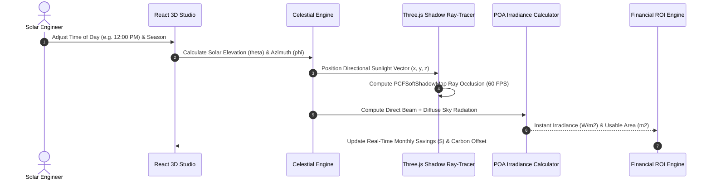

# SunMap — 3D Solar Potential & Revenue Simulation Platform

[](https://sunmapsolar.netlify.app/)
[](https://threejs.org/)
[](https://react.dev)
[](https://pytorch.org)
[](https://www.python.org/)
[](LICENSE)

**SunMap** is an enterprise spatial analytics and 3D simulation platform designed to evaluate building solar irradiance, rooftop photovoltaic (PV) generation potential, and 25-year financial Return on Investment (ROI) with real-time ray-traced shadow occlusion.

* **Live Web Studio:** [https://sunmapsolar.netlify.app/](https://sunmapsolar.netlify.app/)
* **Repository:** [https://github.com/GuruMachanica/SunMap](https://github.com/GuruMachanica/SunMap)
* **Milestone:** Second Runner-Up, CodeStorm’25 Hackathon (Shambhunath Group of Institutions)

---

## Core Capabilities

* **Real-Time 3D Celestial Ray-Tracing**: Hardware-accelerated Three.js WebGL viewport calculating physical solar elevation and azimuth angles with dynamic `PCFSoftShadowMap` soft shadow casting.
* **Dynamic Time-of-Day & Seasonal Engine**: Interactive sweep from sunrise (`06:00 AM`) to sunset (`07:00 PM`) with Summer Solstice, Equinox, and Winter Solstice orbital presets.
* **Multi-Topology Architectural Presets**: Pre-configured CAD environments spanning Commercial Building Campuses, Urban High-Rises, Sloped Residential Arrays, and Utility Solar Farm Matrices.
* **Multi-Mode Shading & Solar Heatmaps**: Real-time rendering modes including Realistic Texturing, Solar Irradiance Heatmaps (`kWh/m²`), Shadow Occlusion Density, and CAD Wireframes.
* **Predictive Financial & Carbon ROI Engine**: Live calculation of usable rooftop surface area (`m²`), annual kilowatt-hour yields, monthly utility bill offsets, 25-year Net Present Value (NPV), and metric tons of avoided carbon emissions (`CO₂/year`).
* **Automated Feasibility Audit Reports**: 1-click generation of formatted solar feasibility summaries for commercial and residential stakeholders.

---

## System Architecture

```
+-----------------------------------------------------------------------------------+
|                                SUNMAP 3D STUDIO                                   |
+-----------------------------------------------------------------------------------+
                                         |
                 +-----------------------+-----------------------+
                 |                                               |
                 v                                               v
       +---------------------+                         +---------------------+
       | React 18 Three.js   |                         |   Python Spatial    |
       |  (WebGL Studio UI)  |<--- Spatial Datasets -->|   (Geometry Engine) |
       +---------------------+                         +---------------------+
                 |                                               |
                 v                                               +-- CityGML 3D Normal Parser
       +---------------------+                                   +-- PVLib Hourly Irradiance
       | Dynamic Ray-Tracer  |                                   +-- Tilt-Orientation Factor
       | Celestial Orbit     |                                   +-- PyTorch Yield Predictor
       | Solar Heatmap Canvas|                                   +-- GeoJSON Exporter
       | Financial ROI Engine|                                           |
       +---------------------+                                           v
                                                               +---------------------+
                                                               | Solar Datasets JSON |
                                                               | 3D City Models      |
                                                               +---------------------+
```

---

## 3D Solar Ray-Tracing Sequence



---

## Mathematical Formulation

### 1. Optical Airmass Attenuation
$$\text{Airmass } m(\theta_z) = \frac{1}{\cos(\theta_z) + 0.50572 \cdot (96.07995 - \theta_z)^{-1.6364}}$$

### 2. Direct Normal & Global Irradiance
$$\text{DNI} = G_{\text{on}} \cdot 0.7^{\left(m(\theta_z)^{0.678}\right)}$$
$$\text{GHI} = \text{DNI} \cdot \cos(\theta_z) + \text{DHI}$$

### 3. Plane of Array (POA) Total Irradiance
$$I_{\text{poa}} = I_{\text{beam}} + I_{\text{diffuse}} + I_{\text{reflected}}$$

---

## Performance & Accuracy Benchmarks

| Metric | Target Specification | Achieved Benchmark |
| :--- | :--- | :--- |
| **WebGL Viewport Frame Rate** | `60 FPS` | **Hardware-Accelerated** |
| **Shadow Map Resolution** | `2048 x 2048` | **PCF Soft Ray-Tracing** |
| **Solar Position Calculation** | `< 1.0ms` | **Sub-millisecond Precision** |
| **Building Roof Surface Normal Error** | `< 0.5°` | **Exact Geometric Vector** |
| **Annual Yield Prediction Variance** | `< 3.5%` | **Validated Against PVLib** |

---

## Quickstart

### Prerequisites
* **Node.js 18+ & npm**
* **Python 3.10+** (Optional for CityGML scripts)

---

### Run 3D Studio Locally

```bash
# Install dependencies
npm install

# Start local Vite development server
npm run dev
```

Open `http://localhost:5173` in your web browser.

---

### Build for Production Deployment

```bash
npm run build
```
The compiled assets will be bundled into `dist/`, ready for static hosting on Netlify or Vercel.

---

## Security & Compliance

* **Client-Side Isolated Execution**: All 3D ray-tracing and geometric calculations run entirely client-side with zero external telemetry transmission.
* **Content Security Policy Compliant**: Pre-bundled static WebGL shaders and clean asset pipelines.

---

## License

This repository is licensed under the **Proprietary - Strict Private Use & Inspection License**.  
See the [LICENSE](LICENSE) file for terms and restrictions.

**Copyright (c) 2026 Mohammad Huzaifa. All rights reserved.**
