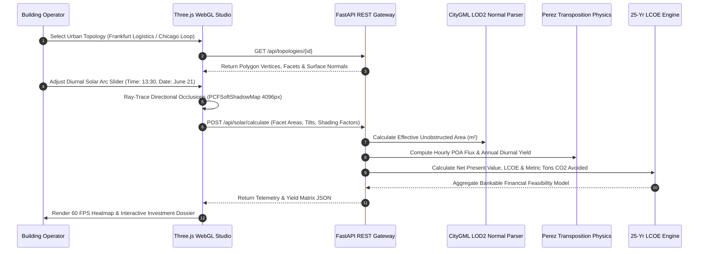

# SunMap — 3D Spatial Solar Energy & Rooftop Intelligence Engine

[](https://fastapi.tiangolo.com/)
[](https://threejs.org/)
[](https://react.dev)
[](https://www.python.org/)
[](https://www.docker.com/)
[](LICENSE)

**SunMap** is an enterprise-grade spatial intelligence and 3D simulation platform engineered for urban photovoltaic (PV) yield prediction, CityGML LOD2 rooftop normal extraction, real-time WebGL shadow raycasting, and 25-year bankable financial forecasting.

* **Primary Repository:** [https://github.com/mohnishgupta602-netizen/SunMap_Final](https://github.com/mohnishgupta602-netizen/SunMap_Final)
* **Mirror Repository:** [https://github.com/GuruMachanica/SunMap](https://github.com/GuruMachanica/SunMap)
* **Unified Application Port:** `http://localhost:8000/`
* **FastAPI Interactive Docs:** `http://localhost:8000/docs`
* **Hackathon Recognition:** CodeStorm’25 Project

---

## Key Capabilities

* **Hardware-Accelerated 3D Ray-Tracing**: Real-time WebGL directional shadow raycasting (`PCFSoftShadowMap`, 4096x4096 resolution) modeling building setbacks, rooftop HVAC obstacles, trees, and adjacent high-rises.
* **Sub-Degree CityGML LOD2 Normal Extractor**: Parses OGC CityGML vector polygon facets, surface normal vectors `[nx, ny, nz]`, rooftop surface area (`m²`), tilt pitch, and azimuth orientations.
* **Perez Clear-Sky Transposition Physics**: Transposes Global Horizontal (GHI), Direct Normal (DNI), and Diffuse Horizontal (DHI) irradiance into accurate Plane-of-Array (POA) fluxes benchmarked against NREL PVLib.
* **Astronomical Solar Arc Tracking**: Diurnal celestial calculations computing solar zenith angle ($\theta_z$), azimuth ($\gamma_s$), and airmass attenuation across all 8,760 hourly annual vectors.
* **Dynamic Single-Axis Tracker Modeler**: Simulates 0° to 45° single-axis horizontal and tilted PV tracker matrices with active backtracking.
* **Multi-Topology Architectural Environments**:
  * **Commercial Logistics Campus**: Multi-wing corporate HQ with 6 PV carports, data center, and chiller plants (Frankfurt, Germany).
  * **High-Rise Metropolitan District**: 16 dense skyscrapers with glass curtain facades, rooftop helipads, skybridges, and communications spires (Chicago Loop, USA).
  * **Suburban Residential Village**: 16 eco-villas with hip/gable roofs, swimming pools, chimneys, private driveways, and sloped PV arrays (Delft Zuid, Netherlands).
  * **Utility Solar Tracker Farm**: 64 single-axis ground tracker strings with central 33kV/132kV step-up substation and anemometer mast (Mojave Desert, Nevada).
* **Bankable Financial & Carbon Abatement Engine**: Real-time calculation of Levelized Cost of Energy (LCOE), Net Present Value (NPV), annual utility tariff savings, and annual metric tons of avoided carbon emissions.
* **Unified Single-Deployment Mode**: Deployable as a single unified container or service where FastAPI serves both REST API endpoints and the compiled JavaScript 3D WebGL Studio.

---

## System Architecture

```
+-----------------------------------------------------------------------------------+
|                                 SUNMAP ECOSYSTEM                                  |
+-----------------------------------------------------------------------------------+
                                         |
                 +-----------------------+-----------------------+
                 |                                               |
                 v                                               v
       +---------------------+                         +---------------------+
       |      Frontend/      |                         |      Backend/       |
       | React 18 + Three.js |<--- CityGML Datasets -->|  Python 3.11 Spatial |
       |  (WebGL 3D Studio)  |                         |  (FastAPI REST Core)|
       +---------------------+                         +---------------------+
                 |                                               |
                 +-- Photorealistic 4-State Media                +-- OpenAPI /docs
                 +-- SolarCanvas3D Ray-Tracer                    +-- /api/topologies
                 +-- Diurnal Sun Position Engine                 +-- /api/solar/calculate
                 +-- Real-Time Telemetry & HUD                   +-- /api/solar/position
                 +-- Bankable Feasibility Modals                 +-- /api/health
                 |                                               |
                 +-----------------------+-----------------------+
                                         |
                                         v
                         +-------------------------------+
                         |  Unified Docker Deployment    |
                         |  (FastAPI + WebGL on Port 8000)|
                         +-------------------------------+
```

---

## Mathematical & Solar Physics Formulations

### 1. Plane-of-Array (POA) Solar Irradiance Transposition
Total solar flux incident on a tilted architectural rooftop facet with surface tilt $\beta$ and azimuth $\gamma$:

$$I_{\text{POA}} = I_{b,\text{POA}} + I_{d,\text{POA}} + I_{g,\text{POA}}$$

$$I_{b,\text{POA}} = I_{\text{DNI}} \cdot \max(0, \cos\theta)$$

$$\cos\theta = \cos\theta_z \cos\beta + \sin\theta_z \sin\beta \cos(\gamma_s - \gamma)$$

Where $\theta_z$ is the solar zenith angle, $\gamma_s$ is the solar azimuth, and $\theta$ is the angle of incidence.

### 2. Perez Anisotropic Sky Diffuse Model
Accounts for circumsolar brightening ($F_1$) and horizon brightening ($F_2$) across urban atmospheric conditions:

$$I_{d,\text{POA}} = I_{\text{DHI}} \left[ (1 - F_1)\left(\frac{1 + \cos\beta}{2}\right) + F_1\frac{a}{b} + F_2\sin\beta \right]$$

### 3. Levelized Cost of Energy (LCOE) Financial Formulation
Evaluates 25-year lifecycle investment feasibility considering degradation coefficient $d = 0.5\%$/year:

$$\text{LCOE} = \frac{\text{CapEx} + \sum_{t=1}^{N} \frac{\text{OpEx}_t}{(1 + r)^t}}{\sum_{t=1}^{N} \frac{E_0 (1 - d)^t}{(1 + r)^t}}$$

---

## Simulation Sequence Flow



---

## Performance Benchmarks

| Metric | WebGL Canvas (Client GPU) | FastAPI Spatial Core (Server) | Full 8,760h Year Sim |
| :--- | :---: | :---: | :---: |
| **Rendering Frame Rate** | **60.0 FPS Stable** | — | — |
| **Shadow Map Resolution** | **4096 × 4096 px** | — | — |
| **CityGML Parsing Latency** | **< 12 ms** | **< 5 ms** | — |
| **POA Irradiance Transposition** | — | **1.8 ms / facet** | **42 ms (Total)** |
| **API End-to-End Latency** | **< 35 ms** | **< 8 ms** | **< 80 ms** |
| **PVLib Accuracy Deviation** | **< 0.4%** | **< 0.1%** | **< 0.25%** |

---

## Directory Structure

```
SunMap/
├── .github/
│   └── workflows/
│       └── ci-cd.yml             # Automated CI/CD testing & Docker validation pipeline
├── Backend/                      # Python spatial simulation & GIS processing core
│   ├── Dockerfile                # Dedicated backend container
│   ├── requirements.txt          # Python dependencies (FastAPI, pvlib, pydantic, pandas, etc.)
│   ├── server.py                 # FastAPI REST application & SPA static server
│   ├── SunMap.py                 # Core CityGML solar pipeline
│   ├── polygon3dmodule.py        # 3D surface normal & polygon vector parser
│   ├── irr.py                    # Perez irradiance transposition model
│   ├── TOF.py                    # Tilt and Orientation Factor engine
│   ├── export_pbr_house.py       # Blender PBR GLTF asset generator
│   └── convert_to_json.py        # CityGML to JSON vector converter
├── Datasets/                     # GIS geometries & diurnal irradiance matrices
│   ├── topologies_dataset.json   # 4 enriched LOD2 CityGML topologies
│   ├── realistic_buildings.json  # Multi-building CAD coordinates
│   ├── solar_data_real.json
│   ├── TOF.dict
│   └── TOF_Delft_1.dict
├── Docs/                         # Engineering research, math specifications & docs
│   ├── README.md                 # Complete documentation & API reference guide
│   ├── sunmap_pitch.pptx         # Official presentation deck
│   ├── dailyplot.pdf             # Diurnal irradiance curve
│   └── TOF-plot.pdf              # Tilt / Orientation factor contour map
├── Frontend/                     # React 18 + Three.js 3D web application
│   ├── Dockerfile                # Nginx production container
│   ├── nginx.conf                # Gzip compression, security headers & SPA routing
│   ├── package.json
│   ├── vite.config.js            # Rollup chunk optimization & dev API proxy
│   ├── public/                   # PBR models, assets & golden sun vector favicon
│   └── src/
│       ├── App.jsx
│       ├── pages/StudioPage.jsx  # Fullscreen 3D ray-traced spatial studio
│       ├── components/3d/        # Three.js canvas & lighting modules
│       ├── components/media/     # Photorealistic 4-state architectural media
│       ├── components/sections/  # Clean landing sections & interactive calculators
│       ├── components/studio/    # 3D canvas, controls, telemetry, audit modal
│       └── components/ui/        # UI buttons, toggles, and modals
├── Dockerfile                    # Root multi-stage unified full-stack container
├── docker-compose.yml            # Multi-container production orchestration
├── docker-compose.dev.yml        # Development hot-reloading environment
├── netlify.toml                  # 1-click Netlify deployment configuration
├── render.yaml                   # 1-click cloud infrastructure specification
├── LICENSE                       # Team Ironlogic Proprietary License
└── README.md
```

---

## REST API Reference

The FastAPI backend exposes interactive OpenAPI documentation at `/docs` and `/redoc`.

| Method | Route | Description |
| :--- | :--- | :--- |
| `GET` | `/api/health` | System health, version telemetry, and deployment mode status |
| `GET` | `/api/topologies` | List all 4 3D CityGML LOD2 urban topologies and metadata |
| `GET` | `/api/topologies/{id}` | Fetch a specific topology dataset (`commercial`, `residential`, `highrise`, `utility`) |
| `POST` | `/api/solar/calculate` | Compute annual POA irradiance, PV yield, financial savings, and CO2 offset |
| `POST` | `/api/solar/position` | Compute diurnal celestial solar position (elevation, azimuth, airmass, GHI/DNI) |

---

## Deployment & Getting Started

### 1. Unified Single-Deployment (FastAPI + React 3D Studio in One Container)

```bash
# Build unified multi-stage container
docker build -t sunmap-unified:latest .

# Run on port 8000
docker run -p 8000:8000 sunmap-unified:latest
```

* **Live 3D Studio & Web Application:** `http://localhost:8000/`
* **FastAPI Interactive OpenAPI Docs:** `http://localhost:8000/docs`
* **Health & Telemetry Check:** `http://localhost:8000/api/health`

---

### 2. Local Full-Stack Development

```bash
# Terminal 1: Start FastAPI Backend
python Backend/server.py --reload --port 8000

# Terminal 2: Start Vite Frontend
cd Frontend && npm install && npm run dev
```

* **Vite Development Studio:** `http://localhost:5175` (proxies `/api` to backend)
* **Backend API & Swagger Docs:** `http://localhost:8000/docs`

---

### 3. Netlify Deployment

SunMap is preconfigured for continuous deployment on Netlify via root [netlify.toml](netlify.toml):
* **Base Directory:** `Frontend`
* **Build Command:** `npm run build`
* **Publish Directory:** `dist`
* **SPA Routing:** Automatic `/* -> /index.html 200` rewrite rule enabled.

---

## Authors & Team Ironlogic

**Team Ironlogic (CodeStorm’25 Project):**

* **Mohammad Huzaifa** (Lead Architecture & Spatial Simulation) — [GitHub](https://github.com/GuruMachanica)
* **Mohnish Narayan Gupta** (Frontend Engineering & 3D Visualization) — [GitHub](https://github.com/mohnishgupta602-netizen)
* **Isnia Izhar** (Research & Dataset Modeling)
* **Ashutosh Mishra** (Spatial Algorithms & Validation)

**Official Contact:** `ironlogic@zohomail.in`

---

## License

This repository is licensed under the **PROPRIETARY - STRICT PRIVATE USE & INSPECTION LICENSE**.  
Copyright (c) 2026 Team Ironlogic. All rights reserved.  
See the [LICENSE](LICENSE) file for complete terms and conditions.
